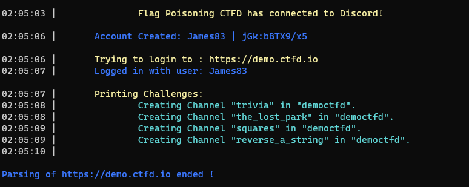
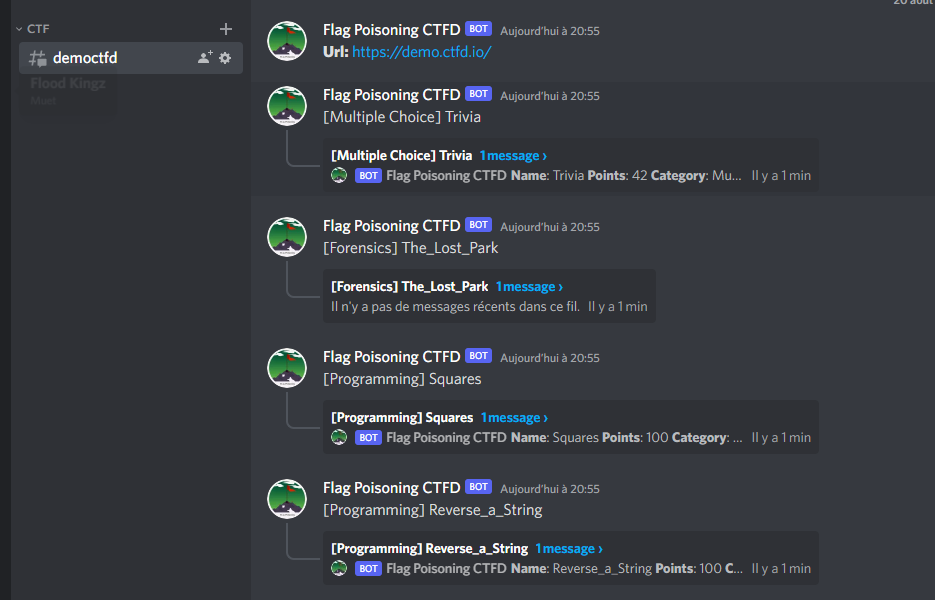
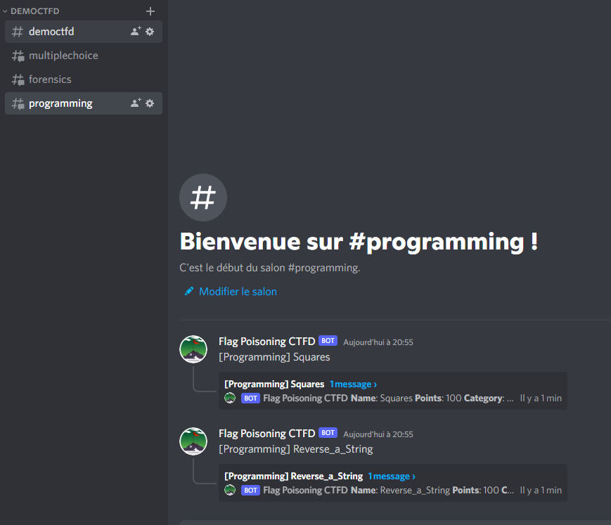
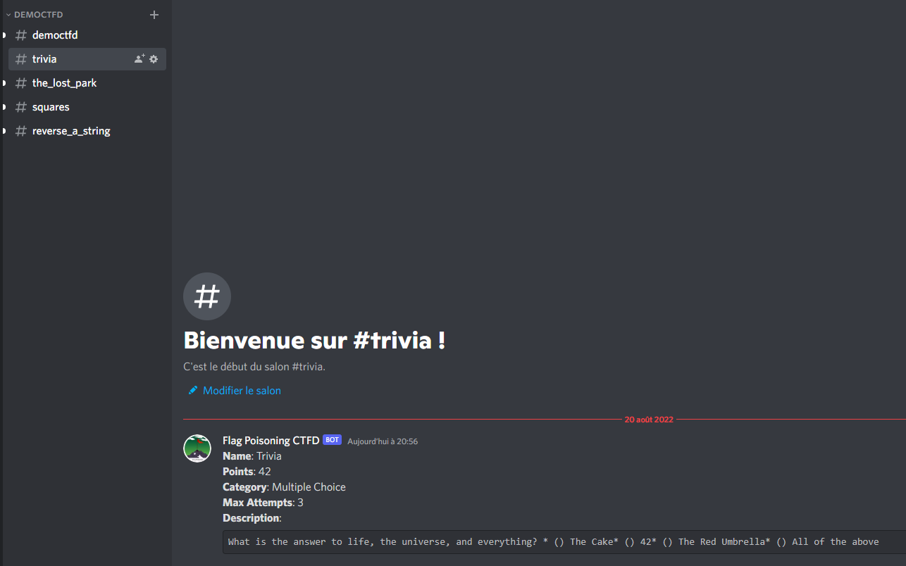
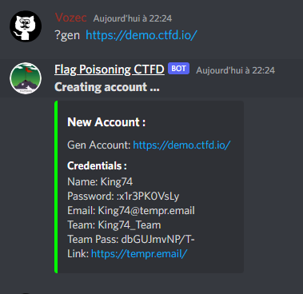
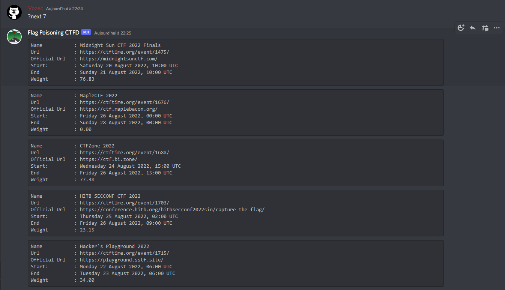
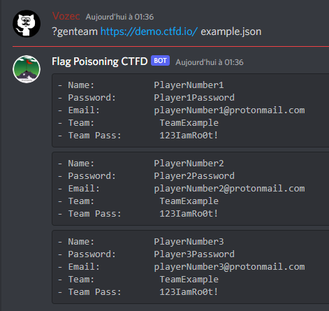

# Discord-CTFD-Parser
This tools is used to create automatically discord threads by scraping ctfd plateform and collecting name , category , description and points of challenges.



## Installation
```bash
cd ~
git clone https://github.com/Vozec/Discord-CTFD-Parser.git
cd Discord-CTFD-Parser
python3 -m pip install -r requirements.txt
```
- Go [here](https://discord.com/developers/applications) and create a ``application``
- Copy the ``TOKEN`` in the ``BOT`` section
- Create a server on discord and invit your bot using the ``URL generator`` *(OAuth2 section)*
```bash
export DISCORD_TOKEN='PLACE-YOUR-TOKEN-HERE'
python3 app.py
```
## Modes
There are 3 type of parsing for the creation of the discord architecture:

#### Mode 1:
- 1 Category per CTF
  - 1 Channel per category
    - 1 Thread in the same channel for each Challenge with the same category  
  

#### Mode 2:
- 1 Category per CTF
  - 1 Channel per Challenge
  

#### Mode 3:
- 1 Category for 1 CTF
  - 1 Channel for each Challenge  
  

*(If, no user/pass is provided : the tool will try generate one random)*

## Help
```
?CreateCTFD <Url> <Mode(1/2/3)> <Username> <Password>
  -> Parse & Create Channels/Categories/Threads for CTF CTFd-based
```
```
?token <mytoken>
  -> Set token account to login & bypass recaptcha
```
```
?gen <Url>
  -> Try to generate new random credentials
```
```
?genteam <Url> <Config.json>
  -> Generate a full team on the CTFd , based on config provided in input or using .json files
```
```
?next <Url> 
  -> Return the next ctfs that will take place in a few days
```
```
?help
  -> Display this menu
```
### Config Example for Team Registration :  
```json
{
    "team":"TeamExample",
    "teampwd":"123IamRo0t",
    "users": [
        ["PlayerNumber1","playerNumber1@protonmail.com","Player1Password"],
        ["PlayerNumber2","playerNumber2@protonmail.com","Player2Password"],
        ["PlayerNumber3","playerNumber3@protonmail.com","Player3Password"]
    ]
}
```

### Example : 

  




